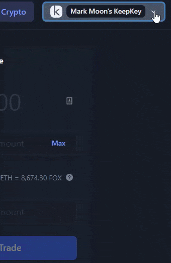

# 🎛 KeepKey Settings

### What are the ways that you can interact with KeepKey on [<mark style="color:blue;">app.shapeshift.com</mark>](https://www.app.shapeshift.com)

* [<mark style="color:blue;">Access KeepKey Settings</mark>](keepkey-settings.md#access-keepkey-settings)
* [<mark style="color:blue;">Change the device label</mark>](keepkey-settings.md#change-the-device-label)
* [<mark style="color:blue;">Change the PIN</mark>](keepkey-settings.md#change-the-pin)
* [<mark style="color:blue;">Access advanced settings</mark>](keepkey-settings.md#access-advanced-settings)
* [<mark style="color:blue;">Change the device timeout</mark>](keepkey-settings.md#change-the-device-timeout)
* [<mark style="color:blue;">Enable passphrase</mark>](keepkey-settings.md#enable-passphrase)
* [<mark style="color:blue;">Wipe device</mark>](keepkey-settings.md#wipe-device)

Read more about the update [<mark style="color:blue;">**here**</mark>](https://shapeshift.com/library/shapeshifts-keepkey-support-grows).

### Access KeepKey Settings

1. Make sure your KeepKey is connected. When connected, the name of your device will show up in the top right corner of the webpage. 
2. Click the device name to access the drop down menu. Select your KeepKey wallet. From here you will see the available KeepKey settings.

If the Bootloader and/or Firmware need to be updated, you will be prompted to update them here. If they are already updated the latest versions, you will see that it says "Up to date" along with the current version in green text (example: V7.2.1).

### Change the device label

1. In wallet settings, click "Label". 
2. Enter the new name for your device and click "Update label".
3. Hold down the button on your KeepKey to update the label.
4. If successful, you will see this message: 
5. You can see now that the device label was successfully changed from "test" to "new label KeepKey".

### Change the PIN

1. Click "PIN" from the settings menu.
2. Click "Update PIN".
3. Hold down the button on your KeepKey to confirm that you want to change your PIN.
4. Enter your new PIN (twice). Be sure to look at your KeepKey's screen to see where the numbers are located and select the corresponding locations on the webpage. _Example: If the number 4 on your device is located in the top right corner you need to also select the square located at the top right corner of the PIN pad._
5. If successful, you will see this message: 

### Access advanced settings

1. Click "Advanced" at the bottom of the settings menu.
2. From here you will see the following options:

### Change the device timeout

1. Select "Device Timeout" from the advanced settings menu.
2. Once asleep, you will need to enter the PIN again before being able to use your KeepKey. The default timeout is 10 minutes. Select the amount of time you would like to pass before your KeepKey goes to sleep.
3. Hold down the button on your KeepKey to change the device timeout.
4. If successful, you will see this message: 

### Enable passphrase

1. If your KeepKey already has a passphrase setup, you can use the advanced settings on app.shapeshift.com to enable it. Please note that you cannot _create_ a passphrase via [<mark style="color:blue;">**app.shapeshift.com**</mark>](https://app.shapeshift.com/dashboard#/dashboard) at this time. If you'd like to setup a passphrase, go to the settings menu on [<mark style="color:blue;">**beta.shapeshift.com**</mark>](https://beta.shapeshift.com/).
2. Toggle on "Enable passphrase".
3. Hold down the button on your KeepKey.
4. If successful, you will see this message: 
5. The next time you go to one of your assets, you will be prompted to enter your passphrase.

### Wipe device

1. Click "Wipe Device".
2. **ONLY** wipe your KeepKey if you have the recovery phrase. Wiping the device without having access to the recovery phrase will mean that your funds are gone **FOREVER**.
3. Confirm that you want to wipe the device by clicking the checkbox. If you are confident that you want to wipe the device, click "Wipe Device".
4. Your KeepKey will now be back to the default settings. You will need to initialize the device to create a new wallet or recover the KeepKey using the recovery sentence to restore your wallet and access your funds. Follow the guide [<mark style="color:blue;">**here**</mark>](how-do-i-recover-on-my-keepkey.md) to recover your wallet.

__
